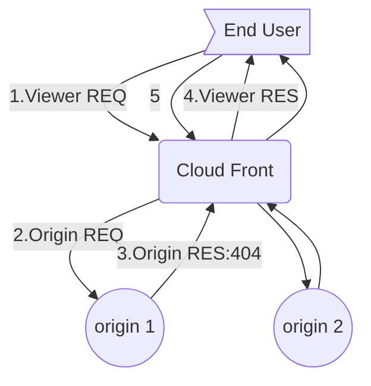

# AWS lambda@edge Example


## Overview

```mermaid
graph TD;
e>End User]
c(Cloud Front)
o((origin))

e--1.Viewer REQ-->c
c--2.Origin REQ-->o
o--3.Origin RES-->c
c--4.Viewer RES-->e
```

## Limits

### Generals

1. Functions cannot invoke calls to resouces outside CloudFornt Pops.
   1. resources at origin servers, access to services in AWS regions such as S3 buckets, DynamoDB tables, etc.
2. Memory is restricted to 128 MB
3. Timeout is restricted to 50 ms.
4. A custom VPC cannot be associated with a Lambda function at the edge.


### Headers

http://docs.aws.amazon.com/AmazonCloudFront/latest/DeveloperGuide/header-restrictions.html


### Role

http://docs.aws.amazon.com/AmazonCloudFront/latest/DeveloperGuide/logging.html

Trust Relationship 을 수정하지 않으면 로그가 안남는다.

```json
{
  "Version": "2012-10-17",
  "Statement": [
    {
      "Effect": "Allow",
      "Principal": {
        "Service": "lambda.amazonaws.com"
      },
      "Action": "sts:AssumeRole"
    },
    {
      "Effect": "Allow",
      "Principal": {
        "Service": "edgelambda.amazonaws.com"
      },
      "Action": "sts:AssumeRole"
    }
  ]
}
```

별도로 실행 role을 만드는 편이 좋다.

## 1. Request Path to Lowercase

예를들어웹페이지에 [http://image.example.com/Images/cheCKer.jpg](http://image.example.com/Images/cheCKer.jpg) 라고 링크되어 지고 해당 URL이 CF로 요청되어진다고가정하면 [CF]에서 원본(S3)로 요청되어 질때는 /images/checker.jpg 라고 모두 소문자 처리되어 요청되어 지게 하는 기능입니다.

```mermaid
graph TD;
e>End User]
c(Cloud Front)
o((origin))

e--1.Viewer REQ: /Images/cheCKer.jpg-->c
c--2.Origin REQ: /images/checker.jpg-->o
o--3.Origin RES-->c
c--4.Viewer RES-->e
```

Bucket Policy

``` json
{
    "Version": "2012-10-17",
    "Statement": [
        {
            "Sid": "AddPerm",
            "Effect": "Allow",
            "Principal": "*",
            "Action": "s3:GetObject",
            "Resource": "arn:aws:s3:::june26-edge-seoul/*"
        }
    ]
}
```

다음 URL을 이용해서 테스트 해볼 것.

http://d1hsmabf5nzeds.cloudfront.net/e_MAjor.mp3

오리진 경로는 아래와 같음.

https://s3.ap-northeast-2.amazonaws.com/june26-edge-seoul/e_major.mp3


## 2. If 404, Retry Other Origin

CF로 요청되어지는 Request의 컨텐츠에 대해, OriginA에서 404코드가 떨어지면, 다른 OriginB으로 재 요청하는 기능

http redirect가 어떨까?




즉,

http://d1hsmabf5nzeds.cloudfront.net/old.jpg

## 3. Rewite

rewrite기능 구현, [http://mv.example.com/main.mp4](http://mv.example.com/main.mp4)를 요청시, intro.mp4 가 먼저 전송되고, main.mp4가 전송되도록 구현.

rewrite URL from req.jpg to req.html to show image with contextual infomation and relevant ads
